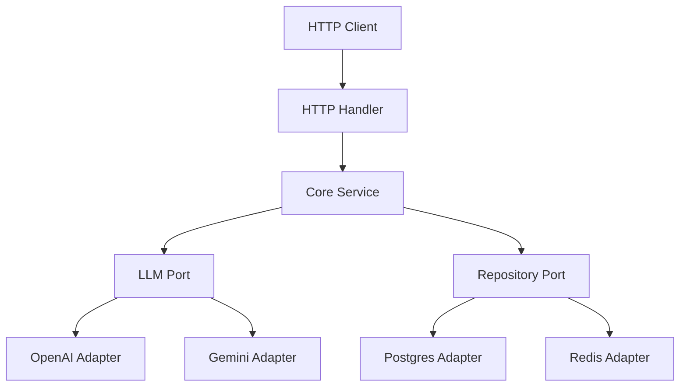

# go-llm-nexus

This repository demonstrates a production-grade backend architecture using Go, HTTP APIs, Redis, PostgreSQL, and modular LLM integration. It is designed to be fast, lightweight, and easily deployable to cloud functions or containerized environments. Users must register a display name before calling the model so that every interaction is auditable.

## Architecture

The project follows **Clean Architecture** (also known as Hexagonal Architecture or Ports & Adapters) to ensure separation of concerns and testability.



### Key Technologies
- **Go**: Core language.
- **HTTP API**: Simple, debuggable JSON transport.
- **Redis**: Real-time data store and caching.
- **PostgreSQL**: Persistent relational database.
- **Docker**: Containerization.
- **Strategy Pattern**: For dynamic LLM provider switching.

## Getting Started

### Prerequisites
- Go 1.21+
- Docker & Docker Compose
- Make

### Setup

1. **Clone the repository**
2. **Setup Environment**
   Copy `.env.example` to `.env` and fill in your API keys.
   ```bash
   cp .env.example .env
   ```
3. **Start Infrastructure**
   ```bash
   make up
   ```
4. **Run Server**
   ```bash
   make run
   ```

### Frontend Development

1. Install dependencies and start the Vite dev server:
   ```bash
   cd web
   npm install
   npm run dev
   ```
2. The dev server automatically proxies `/api/*` requests to `http://localhost:8080`, so the React app always reaches the correct backend port during development. To point the UI at another backend (e.g., staging), set `VITE_API_BASE=https://staging.example.com` in `web/.env` before running `npm run dev` or `npm run build`.

### LLM Pricing Configuration

Optional environment variables let you control the per-1K-token pricing used to estimate cost on every completion. Leave them unset (or `0`) to report token counts without costs.

| Variable | Description |
| -------- | ----------- |
| `OPENAI_MODEL` | Chat model to call (default `gpt-3.5-turbo`). |
| `OPENAI_INPUT_COST_PER_1K` | USD price for 1K prompt tokens for that model. |
| `OPENAI_OUTPUT_COST_PER_1K` | USD price for 1K completion tokens. |
| `GEMINI_MODEL` | Gemini model identifier (default `gemini-2.0-flash-exp`). |
| `GEMINI_INPUT_COST_PER_1K` | USD price for 1K prompt tokens. |
| `GEMINI_OUTPUT_COST_PER_1K` | USD price for 1K output tokens. |

## Project Structure

- `cmd/server`: Entry point of the application.
- `internal/core`: Business logic and domain entities.
- `internal/adapters`: Implementations of external interfaces (DB, LLM, HTTP handlers).

## Features
- **Multi-LLM Support**: Seamlessly switch between OpenAI and Gemini.
- **Resilient**: Pragmatic error handling and logging.
- **Scalable**: Stateless design suitable for Cloud Run/Lambda.
- **Per-User Accountability**: Each user must register and is linked to every prompt/response log.
- **Extensible Providers**: Adding another model is just implementing `ports.LLMProvider` and registering it in `internal/core/services.NewLLMService`.
- **Usage Analytics**: Every response exposes prompt/output token counts plus an estimated USD cost.

## API Overview

All endpoints are prefixed with `/api`.

| Method | Path           | Description                             |
| ------ | -------------- | --------------------------------------- |
| POST   | `/users`       | Register a user by name, returns `id`.  |
| POST   | `/generate`    | Generate content using an LLM provider. |
| GET    | `/health`      | Liveness check.                         |

### Register a User

```bash
curl -X POST http://localhost:8080/api/users \
  -H "Content-Type: application/json" \
  -d '{"name": "Ava"}'
```

Response:

```json
{
  "id": "user-123",
  "name": "Ava",
  "created_at": "2024-01-01T12:00:00Z"
}
```

Persist the returned `id` on the client (e.g., localStorage or a cookie) and send it with every `/generate` call.

### Generate Text

```bash
curl -X POST http://localhost:8080/api/generate \
  -H "Content-Type: application/json" \
  -d '{
    "user_id": "user-123",
    "prompt": "Tell me a joke",
    "provider": "openai",
    "temperature": 0.7,
    "max_tokens": 128
  }'
```

Response:

```json
{
  "content": "Why did the scarecrow win an award? Because he was outstanding in his field!",
  "provider_used": "openai",
  "processing_time_ms": 523,
  "usage": {
    "prompt_tokens": 12,
    "completion_tokens": 42,
    "total_tokens": 54,
    "cost_usd": 0.00007
  }
}
```
