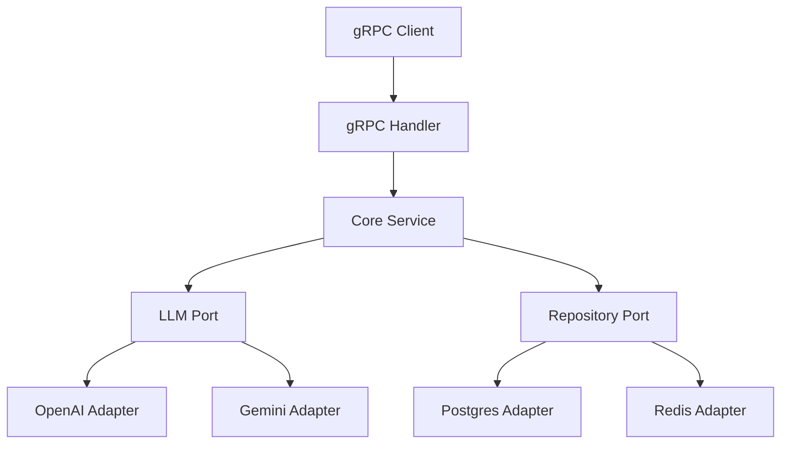

# Production Ready LLM Backend Showcase

This repository demonstrates a production-grade backend architecture using Go, gRPC, Redis, PostgreSQL, and modular LLM integration. It is designed to be fast, lightweight, and easily deployable to cloud functions or containerized environments.

## Architecture

The project follows **Clean Architecture** (also known as Hexagonal Architecture or Ports & Adapters) to ensure separation of concerns and testability.



### Key Technologies
- **Go**: Core language.
- **gRPC**: High-performance RPC framework.
- **Redis**: Real-time data store and caching.
- **PostgreSQL**: Persistent relational database.
- **Docker**: Containerization.
- **Strategy Pattern**: For dynamic LLM provider switching.

## Getting Started

### Prerequisites
- Go 1.21+
- Docker & Docker Compose
- Make

### Setup

1. **Clone the repository**
2. **Setup Environment**
   Copy `.env.example` to `.env` and fill in your API keys.
   ```bash
   cp .env.example .env
   ```
3. **Start Infrastructure**
   ```bash
   make up
   ```
4. **Run Server**
   ```bash
   make run
   ```

## Project Structure

- `cmd/server`: Entry point of the application.
- `internal/core`: Business logic and domain entities.
- `internal/adapters`: Implementations of external interfaces (DB, LLM, gRPC).
- `api/proto`: Protobuf definitions.

## Features
- **Multi-LLM Support**: Seamlessly switch between OpenAI and Gemini.
- **Resilient**: Pragmatic error handling and logging.
- **Scalable**: Stateless design suitable for Cloud Run/Lambda.
